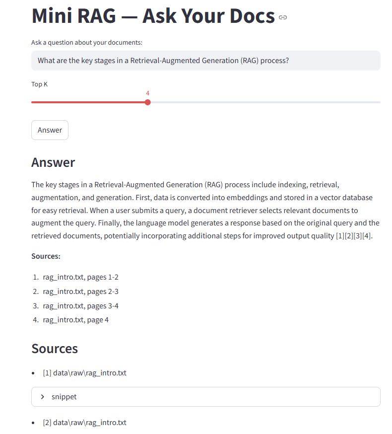

# 📖 Mini RAG (LangChain)

**Ask-Your-Docs (Tiny RAG):**  
Load a handful of local files, build a vector index, and answer questions grounded in those files with short citations.  

This repo is designed as a **minimal, educational project** so you can learn how Retrieval-Augmented Generation (RAG) works using [LangChain](https://www.langchain.com/).  

---

## 🔍 What is RAG?

Retrieval-Augmented Generation (RAG) is a simple but powerful pattern:  
1. **Ingest** your documents → split them into chunks → embed them into a vector database.  
2. **Retrieve** the most relevant chunks for a user query.  
3. **Generate** an answer with an LLM using only the retrieved context.  

This makes LLMs *factual and grounded* in your own data.

---

## 🛠 What we use

- **FAISS or Chroma** for the vector store (persists locally) - choose your preferred backend.
- **HuggingFace embeddings** (`all-MiniLM-L6-v2`) – works offline, no API key needed.  
- **Multiple LLM Providers** - Choose from OpenAI, Google Gemini, Ollama, or your own custom LLM.
- **Python scripts**:
  - `app/ingest.py` → load, split, embed, and index your docs  
  - `app/rag.py` → retrieve + generate pipeline  
  - `app/streamlit_app.py` → simple UI to ask questions  
  - `app/llm_provider.py` → modular LLM wrapper for easy provider switching
  - `app/vector_store_provider.py` → modular vector store wrapper (FAISS/Chroma)

---

## 🗄️ Vector Store Configuration

This project supports both **FAISS** and **Chroma** vector stores. You can easily switch between them.

### Comparison

| Feature | FAISS | Chroma |
|---------|-------|--------|
| **Speed** | Very fast | Fast |
| **Memory** | Efficient | Moderate |
| **Features** | Similarity search | Rich filtering, metadata |
| **Use Case** | Production, large scale | Development, prototyping |

### Configuration

Set in your `.env` file:

```bash
# Vector store provider: "faiss" or "chroma"
VECTOR_STORE_PROVIDER=faiss

# Persist directory
PERSIST_DIR=./index/faiss  # or ./index/chroma
```

---

## 🤖 LLM Provider Configuration

This project supports multiple LLM providers through a modular wrapper system. You can easily switch between providers or add your own company's LLM.

### Supported Providers

| Provider | Description | API Key Env Var |
|----------|-------------|-----------------|
| **gemini** | Google Gemini (default) | `GOOGLE_API_KEY` |
| **openai** | OpenAI ChatGPT | `OPENAI_API_KEY` |
| **ollama** | Local models via Ollama | No key needed |
| **custom** | Your company's LLM | `CUSTOM_LLM_API_KEY` + `CUSTOM_LLM_BASE_URL` |

### Configuration

Set these environment variables in your `.env` file:

```bash
# Required: Choose your provider
LLM_PROVIDER=gemini  # Options: gemini, openai, ollama, custom

# Required: Model name (provider-specific)
LLM_MODEL=gemini-1.5-flash  # See model options below

# Optional: Temperature (0 = deterministic, 1 = creative)
LLM_TEMPERATURE=0
```

### Model Options by Provider

**Google Gemini:**
- `gemini-1.5-flash` (default, fast & efficient)
- `gemini-1.5-pro` (more capable)
- `gemini-pro`

**OpenAI:**
- `gpt-4o-mini` (fast & affordable)
- `gpt-4o` (most capable)
- `gpt-3.5-turbo`

**Ollama (local):**
- `llama2`
- `mistral`
- `codellama`
- Any model you've pulled with `ollama pull`

### Getting API Keys

- **Google Gemini:** Get your free API key at [Google AI Studio](https://aistudio.google.com/apikey)
- **OpenAI:** Get your API key at [OpenAI Platform](https://platform.openai.com/api-keys)

---

## 🔧 Adding Your Company's Custom LLM

The `llm_provider.py` module makes it easy to integrate your company's proprietary LLM.

### Option 1: OpenAI-Compatible API (Easiest)

If your company's LLM has an OpenAI-compatible API endpoint, just set:

```bash
LLM_PROVIDER=custom
LLM_MODEL=your-model-name
CUSTOM_LLM_API_KEY=your-api-key
CUSTOM_LLM_BASE_URL=https://your-company-llm-api.com/v1
```

### Option 2: Custom Implementation

Create a new provider class in `llm_provider.py`:

```python
class MyCompanyLLMProvider(BaseLLMProvider):
    """Your custom company LLM provider."""
    
    def __init__(self, model: str, temperature: float = 0, **kwargs):
        super().__init__(model, temperature, **kwargs)
        # Add your initialization logic here
    
    def get_llm(self):
        """Return your custom LLM instance."""
        from langchain_openai import ChatOpenAI
        return ChatOpenAI(
            model=self.model,
            temperature=self.temperature,
            api_key="your-api-key",
            base_url="your-endpoint-url"
        )
```

Then register it:

```python
LLMFactory.register_provider("mycompany", MyCompanyLLMProvider)
```

---

## ⚡ Quickstart

Clone the repo and set up your environment:

```bash
git clone https://github.com/yourusername/mini-rag-langchain.git
cd mini-rag-langchain

# Create venv
python -m venv .venv && source .venv/bin/activate   # Windows: .venv\Scripts\activate

# Install dependencies
pip install -r requirements.txt

# Copy config
cp .env.example .env

# Edit .env and add your API key
# For Gemini (default): GOOGLE_API_KEY=your-key-here
# For OpenAI: LLM_PROVIDER=openai and OPENAI_API_KEY=your-key-here

# Prepare your docs: Drop some .pdf, .md, or .txt files into data/raw/
mkdir -p data/raw

# Run data ingestion - Build the index
python app/ingest.py

# Run Streamlit UI to query dB
streamlit run app/streamlit_app.py
```

## Streamlit UI



---

## 📁 Project Structure

```
rag-langchain-starter-main/
├── app/
│   ├── config.py              # Configuration settings
│   ├── ingest.py              # Document ingestion pipeline
│   ├── rag.py                 # RAG pipeline (retrieve + generate)
│   ├── streamlit_app.py       # Streamlit UI
│   ├── llm_provider.py        # LLM wrapper module
│   └── vector_store_provider.py # Vector store wrapper (FAISS/Chroma)
├── data/
│   └── raw/                   # Place your documents here
├── index/
│   ├── faiss/                 # FAISS index (if using FAISS)
│   └── chroma/                # Chroma DB (if using Chroma)
├── .env.example               # Example environment configuration
├── requirements.txt           # Python dependencies
└── README.md
```

---

## 🔑 Environment Variables Reference

| Variable | Description | Default |
|----------|-------------|---------|
| `LLM_PROVIDER` | LLM provider to use | `gemini` |
| `LLM_MODEL` | Model name | `gemini-1.5-flash` |
| `LLM_TEMPERATURE` | Sampling temperature | `0` |
| `VECTOR_STORE_PROVIDER` | Vector store backend | `faiss` |
| `GOOGLE_API_KEY` | Google Gemini API key | - |
| `OPENAI_API_KEY` | OpenAI API key | - |
| `CUSTOM_LLM_API_KEY` | Custom LLM API key | - |
| `CUSTOM_LLM_BASE_URL` | Custom LLM endpoint URL | - |
| `OLLAMA_BASE_URL` | Ollama server URL | `http://localhost:11434` |
| `EMBED_MODEL` | Embedding model name | `all-MiniLM-L6-v2` |
| `PERSIST_DIR` | Vector DB directory | `./index/faiss` |
| `DATA_DIR` | Documents directory | `./data/raw` |
| `TOP_K` | Number of chunks to retrieve | `4` |